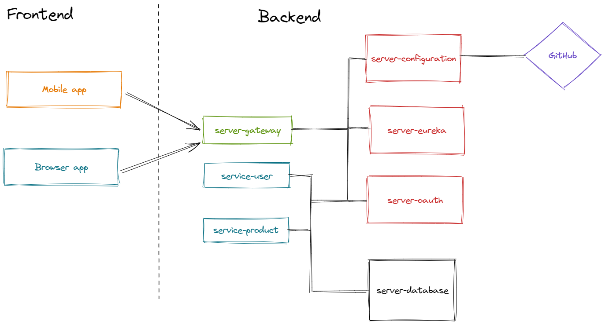
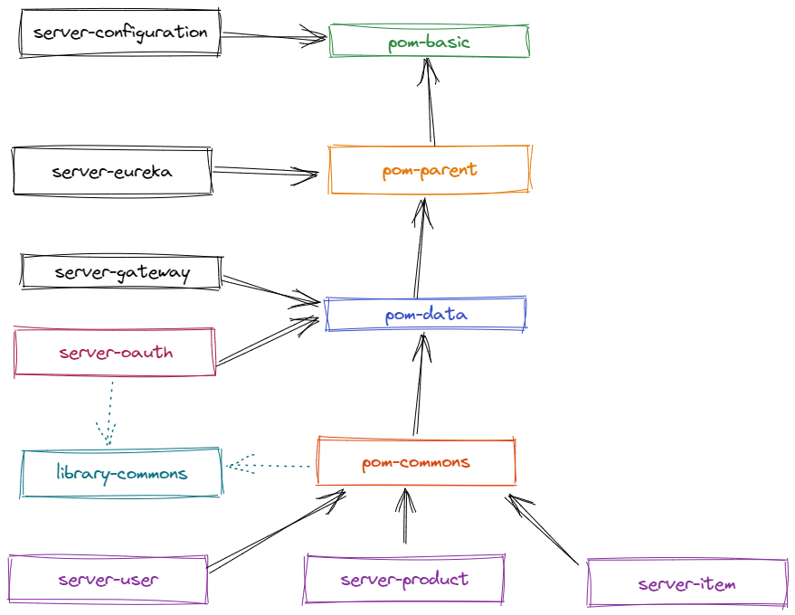

# Proyecto Microservicios (backend)

>Nota: Proyecto de pruebas para usar <kbd>Java 18</kbd>, <kbd>Spring Boot 2.7.1</kbd>, <kbd>MySQL 8</kbd>, <kbd>Docker </kbd>, <kbd>GitHub</kbd>, <kbd>Postman</kbd>.

## Content
- [1. Considerations](#Considerations)
- [2. Dependencies](#Dependencies)
- [3. Schema](#Schema)
- [4. Release notes](#Releases)
- [5. Prerequisites](#Prerequisites)
- [6. IDE](#IDE)
- [7. Technologies](#Technologies)
- [8. Specifications](#Specifications)
- [9. Author](#Author)

## Considerations

El proyecto cuenta con una configuración centralizada, un servidor de autodescubrimiento, tolerancia a fallos, balanceo de cargas y autoescalado.
Cuenta con la implementación de Spring Data REST y API RESTful HAL.

>Nota: Antes de importar este proyecto, tener en cuenta que solo está configurado para correr localmente o en contenedores docker en un ambiente local.
Este proyecto está en un estado de prueba, actualmente en desarrollo.
Se crearon los proyectos:

Este repositorio contiene el código fuente de los microservicios e información acerca de su uso:  
- **Librerías:**  
**library-commons:** Para anexar clases comunes entre los distintos microservicios, se debe generar el .jar.  
**pom-parent:** Definición de dependencias.  
- **servidores:**  
**server-configuration:** Servidor de configuraciones.  
**server-eureka:** Servidor eureka para poder acceder a los microservicios por su nombre asignado.  
**server-oauth:** Servidor de autenticación.  
**server-gateway:** Servidor gateway que se usa como puerta de enlace a los microservicios, centraliza la seguridad y el manejo de cors.  
- **servidores adicionales:**  
**mysql-server:** Servidor de datos.  
**rabbitmq-server:**   
**server-zipkin:**  
- **servicios:**  
**service-user:** Servicio de usuarios.  
**core-product:** Servicio de productos.  
**bus-item:**  Servicio de items.   
**microservices-configuration:** Contiene los archivos de configuración.

## Schema
**Esquema general de los microservicios:**  
El frontend se comunica con el server-gateway para acceder a los distintos microservicios (por ejemplo service-user) mediante rutas.  
El gateway centraliza la seguridad, por lo que se debe autorizar (server-oauth) antes de acceder al microservici, además usa un balanceador de carga.
Los distintos microservicios son los que tienen el acceso a la base de datos.  
Todos los microservicios tienen la configuración centralizada gracias (server-configuration).

## Dependencies
**Descripción de la estructura de las dependencias:**  

  

[Archivo detallado de las dependencias](https://docs.google.com/spreadsheets/d/1406GgKI7IdRAAd8Sn8Ksaj6RcQUkca6NdZiwLTvI9SM/edit#gid=0).

## Releases
Para más detalles sobre los cambios y el estado de cada versión, ingresa al [Release Notes](src/main/resources/documentation/release_notes/README.md).

## Prerequisites
- Tener instalado JRE 18 +.
- Configurar las variables de entorno user <kbd>jdk-18.0.1.1</kbd> (solo para desarrollo).
- En caso de querer desarrollar funcionalidades contar con un IDE como por ejemplo Intellij IDEA o Eclipse.

## IDE
Este repositorio contiene solamente un módulo.
Simplemente, puede importar ese módulo en particular en IntelliJ IDEA o Eclipse.

## Technologies
Listado de las tecnologías usadas para este proyecto:
- [Java](https://java.com): Version 18
- [Spring Boot](https://spring.io/projects/spring-boot): Version 2.7.1
- [Gradle](https://gradle.com): Version 7.1.1
- [MySQL](https://www.mysql.com): Version 8.0.25
- [Mockito](https://site.mockito.org)
- [Postman](https://www.postman.com)

## Specifications
Para más detalles sobre los microservicios, ingresa a [Specifications](src/main/resources/documentation/README.md).

## Author
Para más detalles sobre el autor, ingresa a [Author](src/main/resources/documentation/author/README.md).

***
#### [content](#content)
